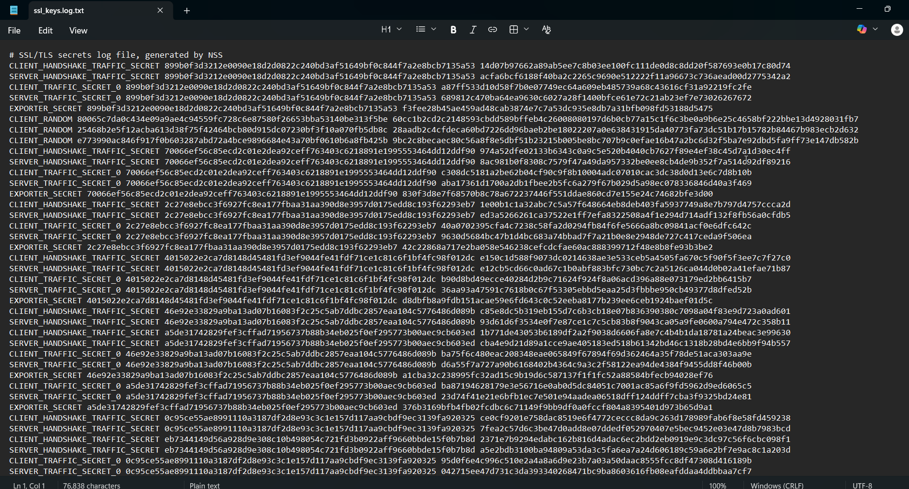
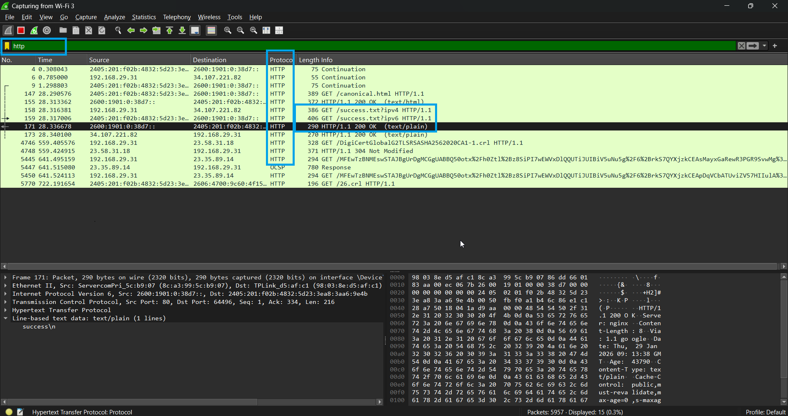
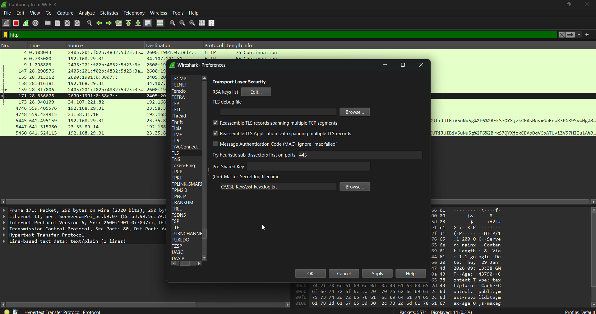
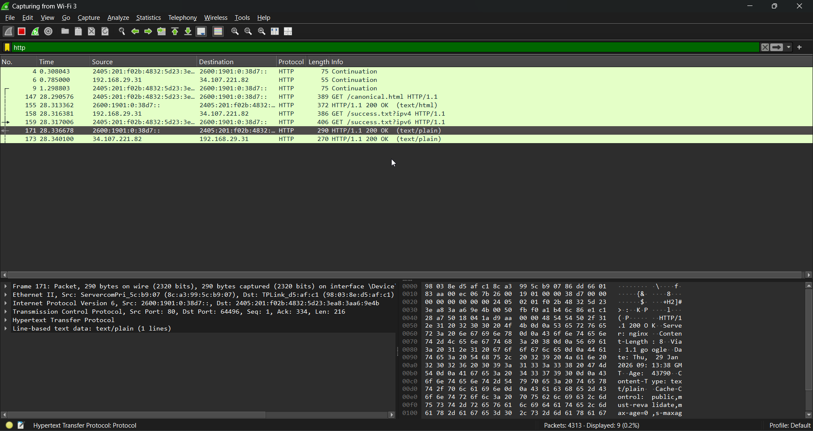

# Advanced Network Analysis: HTTPS Decryption & SSL/TLS Analysis 🔐🔓
This project demonstrates the process of decrypting HTTPS (SSL/TLS) traffic using Wireshark by capturing and utilizing session keys from a web browser. It provides deep insight into how encrypted communication works and how security analysts inspect secure traffic.
🎯 Project Objective
The goal was to move beyond basic packet sniffing and successfully decrypt encrypted application data to perform a Deep Packet Inspection (DPI).
🛠️ Technical Workflow
SSL Key Logging: Configured an environment variable (SSLKEYLOGFILE) in Windows to instruct the browser (Edge/Chrome) to log pre-master secrets to a local file.
Secret Key Capture: Verified the generation of keys in the log file, which include CLIENT_RANDOM and traffic secrets required for decryption.
Wireshark Configuration: Linked the captured key log file to Wireshark’s TLS protocol preferences to allow real-time decryption.
Traffic Analysis: Filtered the traffic for http to view decrypted payloads that were previously hidden under TLS encryption.
📊 Key Artifacts
1. SSL/TLS Key Log
The following image shows the session keys successfully extracted from the browser session:

2. Decrypted HTTP Traffic
Below is the evidence of decrypted traffic where plain-text HTTP requests (e.g., GET /success.txt) are visible within an encrypted stream:

💡 Key Learnings
Understanding the SSL/TLS Handshake (Client Hello, Server Hello, Key Exchange).
Mastery of Wireshark’s advanced protocol decryption features.
Practical knowledge of how security tools (like Next-Gen Firewalls) inspect encrypted traffic for threats.

